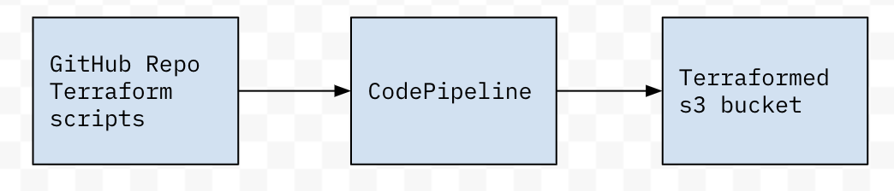

# Terraform with CodePipeline

Sets up CodePipeline, triggered from webook in a GitHub repo with Terraform scripts, such
that a push to the repo causes the Pipeline to run `terraform apply` with the
new code.

# Usage

Recommended to fork this repo for yourself, point the CodePipeline to that, so
you have control over it!

Setup GitHub Oauth token for CodePipeline:
- On [GitHub settings](https://github.com/settings/tokens/new), create new Personal access token (also see [AWS doco](https://docs.aws.amazon.com/codebuild/latest/userguide/sample-access-tokens.html)) with permissions:
    - repo
    - repo:status
    - admin:repo_hook
- copy the token, and put in Makefile in place of XXX_CHANGE_THIS_XXX (just err
    don't commit this ..)
- `make deploy`

CodePipeline consists of 
- Source GitHub repo (by default, [rdkls/terraform-codebuild-demo](https://github.com/rdkls/terraform-codebuild-demo)) (as mentioned earlier, you should for and update Makefile)
- InvokeTerraform CodeBuild step running `terraform apply tf` (i.e. will run with templates
    in the 'tf' directory)

# References

https://ruempler.eu/2017/02/26/continuous-infrastructure-delivery-pipeline-aws-codepipeline-codebuild-terraform/
